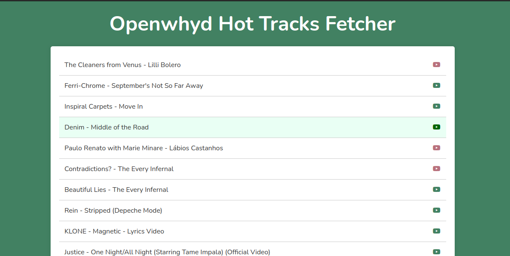

# ▶️ Openwhyd Hot Tracks Fetcher

This project fetches and displays the "Hot Tracks" from the Openwhyd Data Export API. It dynamically renders the list of tracks using JavaScript and provides clickable links to the respective music platforms (e.g., YouTube). The project also uses localStorage to cache the fetched data, improving performance by avoiding unnecessary API calls on subsequent visits.

## Table of Contents

- [Features](#features)
- [Technologies Used](#technologies-used)
- [How It Works](#how-it-works)
- [Demo](#demo)
- [API Reference](#api-reference)
- [Preview](#preview)

## Features

- Fetches hot tracks from the Openwhyd API using Fetch API
- Dynamically displays the track names and links to YouTube
- Uses a CORS proxy to handle API requests
- Caches tracks in localStorage to reduce API calls
- Basic responsiveness to make the UI adapt to mobile devices

## Technologies Used

- **HTML5**
- **CSS3**
- **JavaScript (ES6)**
- **Openwhyd API**
- **LocalStorage**
- **CORS Proxy** (corsproxy.io)

## How It Works

1. **Fetch Data**: The app checks if the track data is already stored in `localStorage`. If not, it sends a request to the Openwhyd Data Export API via a CORS proxy to retrieve the latest hot tracks.
2. **Cache Data**: After fetching the tracks, the app stores them in `localStorage` for future use.
3. **Render Tracks**: The tracks are rendered dynamically in the HTML `<ul>` element. Each track is displayed as an `<li>` with a link that opens in a new tab, pointing to the music platform (YouTube).

## Demo

You can try out the Track Fetcher by visiting the following link:
[Openwhyd Hot Tracks Fetcher](https://diecatiamonteiro.github.io/pokemon-finder/)

## API Reference

- Openwhyd Data Export API: https://openwhyd.org/hot?format=json. This API provides the "hot tracks" in JSON format.

## Preview

